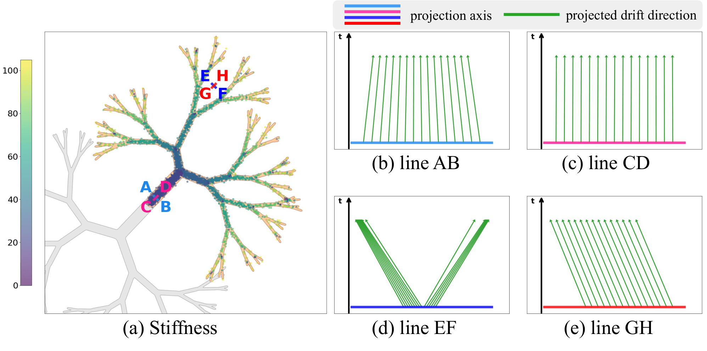

<div align="center">
  <h1>Error as Signal: Stiffness-Aware Diffusion Sampling via Embedded Runge-Kutta Guidance</h1>
  <p>Inho Kong*, Sojin Lee*, Youngjoon Hong†, Hyunwoo J. Kim†</p>
  
  <p>
    <a href="https://openreview.net/forum?id=wKX9OL0leb" target='_blank'>
      
    </a>
    <!-- <a href="https://arxiv.org/abs/xxxx.xxxxx" target='_blank'>
      
    </a> -->
  </p>
</div>

This repository contains the official implementation of **_ERK-Guid_** (**E**mbedded **R**unge-**K**utta **Guid**ance) accepted at **ICLR 2026**.

**ERK-Guid** proposes a novel **stiffness-aware guidance method** that stabilizes the diffusion generation process without requiring any additional network evaluations.

## 💡 Method Overview
<div align="center">
  
</div>

\
Diffusion models often struggle with numerical instability in specific regions. ERK-Guid addresses this by leveraging the following observations:

1. **Stiffness and Local Truncation Error (LTE):** In non-stiff regions (e.g., lines AB and CD), the ODE drift remains relatively stable. However, in highly stiff regions, the drift changes drastically along a specific direction, the dominant eigenvector (e.g., line EF). This sharp variation is the primary cause of severe Local Truncation Errors (LTE) during the sampling process.
2. **Targeting the Dominant Eigenvector:** To effectively stabilize the generation, it is crucial to suppress the errors that occur predominantly along this dominant eigenvector axis when the local stiffness is high.
3. **Cost-Free Estimator:** We utilize the ERK solution/drift difference to efficiently estimate both the local stiffness and the dominant eigenvector without requiring any additional network evaluations.
4. **ERK-Guid Formulation:** We first theoretically approximate the LTE along this dominant axis, and then construct a stabilized guidance scheme using these cost-free estimators.

## 🛠 Environment Setup

The code was tested on **Ubuntu, CUDA 12.1, and RTX 3090 GPUs**.

**1. Create and activate the Conda environment:**
You can set up the environment using the provided `environment.yml` or manually via the commands below:

```bash
conda create -n ERK-Guid python=3.10 -y
conda activate ERK-Guid

# Install PyTorch and related packages
conda install pytorch==2.5.1 torchvision==0.20.1 torchaudio==2.5.1 pytorch-cuda=12.1 -c pytorch -c nvidia

# Install required pip packages
pip install huggingface-hub==0.20.2 diffusers==0.26.3 accelerate==0.27.2 click==8.3.1 scipy==1.15.3
```

**2. Install `torch-fidelity` for metric calculations:**
```bash
pip install -e git+https://github.com/toshas/torch-fidelity.git@master#egg=torch-fidelity
```

## 🚀 Usage

Our codebase is built on top of the [EDM2](https://github.com/NVlabs/edm2) pipeline. The core ERK-Guid logic is implemented in `generate_images.py`.

### Reproducing Tables 2 & 3

We provide a bash script to reproduce the sampling and evaluation results for Table 2 and Table 3.

*Note: Ensure you have the reference statistics (`dataset-refs/img512.pkl`) downloaded following the original EDM2 instructions. To evaluate Precision and Recall, you also need the original ImageNet dataset. Once you download, resize, and center-crop the images, pass the folder path as `input2` in the `calculate_precision_recall_is.py` script.*

```bash
# Run the evaluation script (Uses 8 GPUs by default)
bash scripts/reproduce.sh
```
Images are temporarily generated in the `output/` directory for evaluation (FID, FD-DINOv2, Precision, Recall, IS) and automatically removed afterward to save disk space. The final numerical results will be appended to `output/result.txt`.

### Reproducing Table 4

**1. Clone the `diff-sampler` repository:**
```bash
git clone https://github.com/zju-pi/diff-sampler.git
```

**2. Replace the original `solvers.py` with our provided implementation:**
```bash
cp src/solvers_erk_guid.py diff-sampler/diff-solvers-main/solvers.py
```

**3. Integrate hyperparameters:** Modify the sampling scripts in `diff-sampler` to accept and pass our custom hyperparameters (`w_stiff` and `w_con`) down to the replaced solver function.

**4. Run your modified sampling scripts:** (The exact values for $w_{stiff}$ and $w_{con}$ used in our experiments are detailed in the paper).

## 📌 Citation

If you find this code useful for your research, please cite our paper:

```bibtex
@inproceedings{kong2026error,
  title={Error as Signal: Stiffness-Aware Diffusion Sampling via Embedded Runge-Kutta Guidance},
  author={Kong, Inho and Lee, Sojin and Hong, Youngjoon and Kim, Hyunwoo J},
  booktitle={International Conference on Learning Representations (ICLR)},
  year={2026},
  note={Accepted to ICLR 2026}
}
```

## 🙏 Acknowledgements

This repository heavily borrows from the excellent codebases of [EDM2](https://github.com/NVlabs/edm2) by NVIDIA and [diff-sampler](https://github.com/zju-pi/diff-sampler). We thank the authors for their open-source contributions.
